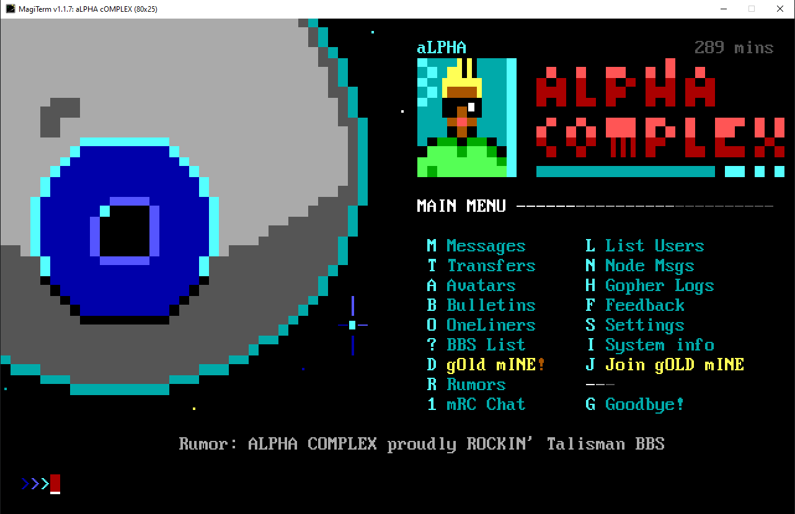

# ⛏️ Gold Mine Community Door Server


gOLD mINE (named after a [coin-op arcade](https://arcadepreservation.fandom.com/wiki/Gold_Mine) near where aLPHA grew up) is a terminal-based Community Door Server for BBS games. Open to all, easy to access with modern BBS terminal software, like [SyncTerm](https://syncterm.bbsdev.net/), [MagiTerm](https://gitlab.com/magickabbs/MagiTerm) or [NetRunner](http://www.mysticbbs.com/downloads.html).

gOLD mINE has [Synchronet](http://wiki.synchro.net/) (Ubuntu 20.04 x64) under the hood, and runs on port ``513`` at ``165.232.153.209``.

It is not a BBS, despite using BBS software. There are no message boards or file download areas, and you can't "login" to it like a traditional BBS. It does one thing, and one thing only: launch games remotely for users from other BBSs.

## WHAT'S A 'DOOR SERVER'?

If you run an old-school, terminal-based BBS (probably using new-school BBS software like [Mystic](http://www.mysticbbs.com/), [Synchronet](http://wiki.synchro.net/), [Talisman](talismanbbs.com) or [ENiGMA½](https://enigma-bbs.github.io/)) you know that setting up door game programs can be time consuming and a headache. In their heydey of the 1980's and 90s, these games where designed to run under DOS (or Win32) and were pretty finicky. Hunting down registration keys or cracks can be daunting (much is abandonware these days). 

Oh, and if your BBS runs on modern Windows 64-bit, well, unless you can figure out how to use experimental [NTVDMx64](https://github.com/leecher1337/ntvdmx64) and legacy [FOSSIL drivers](http://pcmicro.com/netfoss/) to run native 16-Bit DOS programs, your options are limited. And ARM-based systems like Raspberry Pi can't even run dosemu, so you'd need to use programs like [QEMU](https://www.sunrisedoors.com/linuxsetup.php) (powerful, but a complex setup for a BBS) or [DOSBox](https://www.dosbox.com/) (easier, but with no multi-node capabilities).

Phew.

So, a Door Server takes a lot of the work out of setup and lets you add 100's of these games from a central service, almost immediately, running them over an RLOGIN connection that's practically seamless for your users. And Linux users, no need for [DOSEMU](http://www.dosemu.org/) shenanigans. In fact, gOLD mINE can handle just about any kind of console-based game made for DOS, Linux or Windows. It also suport Synchronet Javascript-based games. With direct-door launching, it feels like users never leave yuor BBS!

The other benefit is a potentially larger player base, aggregating them in a centralized manner. 

Also, please check out other door gamer servers like [DoorParty](http://www.throwbackbbs.com/), [BBSLink](https://bbslink.net/), [CombatNet](http://combatnet.us/), and [Black Country Rock](https://www.telnetbbsguide.com/bbs/bcr-games-server/) game servers. They're all good choices. Hell, join them all!

## JOIN GOLD MINE



## SIGNUP AT ALPHA COMPLEX

BBS SysOps can join by visiting ``alphacomplex.us:2323`` with a terminal program like [SyncTerm](https://syncterm.bbsdev.net/), [NetRunner](http://www.mysticbbs.com/downloads.html) or [MagiTerm](https://gitlab.com/magickabbs/MagiTerm). Hit ``[J] JOIN GOLDMINE`` from the main menu. 
Just fill out the form, and your BBS IP address will be queued for white-listing on the firewall, so you can then connect on port 513 via RLOGIN. 

🆕 Try it out/sign up over the web [HERE](https://www.alphacomplex.us/)!

## SETUP ON YOUR BBS

Setup an outbound RLOGIN connection from a menu item on your BBS. Note, you *must* be signed up on Alpha Complex for this to work.


### EXAMPLE: TALISMAN BBS
- If you're a Talisman sysop, add to an existing menu (e.g. ``main.toml`` )

```
[[menuitem]]
command = "RUNSCRIPT"
hotkey = "D"
data = "goldmine"
```
- Create ``goldmine.lua`` in your /bbs/scripts directory:

```
local un = bbs_get_username()
bbs_clear_screen()
bbs_write_string("Loading GOLD MINE arcade...")
bbs_rlogin_ip4("165.232.153.209","513","","[TAG]"..un,"")
``` 
                                                                      
- Replace ``TAG`` with your unique 1-3 character BBS tag, e.g ``[ABC]``.        


### EXAMPLE: MYSTIC BBS
Add to your menu as ``IR - Outbound RLOGIN Connection``

```
/addr=165.232.153.209 /user=[TAG]@USER@ /PROMPT
```

- Replace ``TAG`` with your unique 1-3 character BBS tag, e.g ``[ABC]``.    
- Make sure there are no spaces between ``[TAG]`` and ``@USER@``
- FYI: ``/PROMPT`` hides the connection string from the user

## DIRECT LAUNCH

If you want to launch a door game directly from your BBS, bypassing the Gold Mine main menu:

Mystic (make sure you are using the most recent release):

- add ``/term=xtrn=DOORCODE`` directly after ```/user``` sequence (on Mystic) or ```"..un,"``` (on Talisman). 
- Replace ```DOORCODE``` with an xtrn code below that you want to launch directly, e.g. on a Mystic BBS:

```
/addr=165.232.153.209 /user=[TUG]@USER@ /term=xtrn=WORDLE /PROMPT
```
For Talisman, you can create a lua file in ``scripts`` that contains:

```
local un = bbs_get_username()
bbs_rlogin_ip4("165.232.153.209","513","","[TAG]"..un,"xtrn=mrc")
```

# GoldMine Game Code List

I'm trying to make sure all games on gOLD mINE are fully registered. If you have a registered game you'd like to donate, please contact me.


| DOOR NAME                             | GENRE                       | CODE     | ADDED    |
|---------------------------------------|-----------------------------|----------|----------|
| BBS Tris                              | Action                      | BBSTRIS  | 03/14/22 |
| Five Card Stud                        | Cards, Dice & Casino        | FIVECARD | 03/14/22 |
| Accordian Solitaire                   | Cards, Dice & Casino        | AS       | 03/14/22 |
| Adventurer's Maze II                  | RPGs: Medieval & Fantasy    | AM2      | 03/14/22 |
| Entertainment Awards Trivia           | Trivia                      | AWARDS   | 03/14/22 |
| Usurper                               | RPGs: Medieval & Fantasy    | USURPER  | 03/14/22 |
| Forbidden Planet                      | DOS Text-Based              | PLANET   | 03/13/22 |
| Showbiz Quiz                          | Trivia                      | SBQUIZ   | 03/13/22 |
| Star Trek Quiz                        | Trivia                      | STQUIZ   | 03/13/22 |
| Las Vegas Blackjack                   | Cards, Dice & Casino        | LVBJACK  | 03/13/22 |
| Las Vegas Keno                        | Cards, Dice & Casino        | LVKENO   | 03/13/22 |
| Las Vegas Video Poker                 | Cards, Dice & Casino        | LVPOKER  | 03/13/22 |
| Las Vegas Slots                       | Cards, Dice & Casino        | LVSLOTS  | 03/13/22 |
| Las Vegas Craps                       | Cards, Dice & Casino        | LVCRAPS  | 03/13/22 |
| MystMan                               | Action                      | MYSTMAN  | 03/13/22 |
| Stellar Quest                         | Space                       | SQUEST   | 03/13/22 |
| Stacktion                             | Puzzle                      | STACKTIO | 03/12/22 |
| GuTTeRBoWL                            | Leisure & Sports            | GUTBOWL  | 03/12/22 |
| King's Crown                          | RPGs: Medieval & Fantasy    | KC       | 03/11/22 |
| Exitilus                              | RPGs: Medieval & Fantasy    | EXIT     | 03/11/22 |
| Global War                            | RPGs: War, Present & Future | GWAR     | 03/11/22 |
| Forces of Darkness                    | RPGs: War, Present & Future | FOD      | 03/10/22 |
| BBS Wordle                            | Word Games                  | WORDLE   | 03/10/22 |
| DrugLord                              | Adult                       | DRUGLORD | 03/09/22 |
| Bordello                              | Adult                       | BORDELLO | 03/09/22 |
| Pimp Wars                             | Adult                       | PIMPWARS | 03/09/22 |
| Bordello                              | Adult                       | BORDELLO | 03/09/22 |
| Rancho Nevada                         | Adult                       | RN       | 03/09/22 |
| Piss-o-Rama                           | Action                      | PISSORAM | 03/09/22 |
| Gooble Gooble                         | Action                      | GOOBLE   | 03/09/22 |
| Lemons                                | Action                      | LEMONS   | 03/09/22 |
| Chicken Delivery                      | Action                      | CHICKEN  | 03/09/22 |
| 4 Coner Checkers                      | Board Game                  | 4CORNERC | 03/09/22 |
| Bubble Boggle                         | Board Game                  | BOGGLE   | 03/09/22 |
| Sea Battle                            | Board Game                  | SEABATTL | 03/09/22 |
| 3-Pair Poker                          | Cards, Dice & Casino        | 3PAIRPOK | 03/09/22 |
| Acey Deucy                            | Cards, Dice & Casino        | ACEYDEUC | 03/09/22 |
| Baseball Dice                         | Cards, Dice & Casino        | BBDICE   | 03/09/22 |
| Blackjack                             | Cards, Dice & Casino        | BLACKJAC | 03/09/22 |
| Box Poker                             | Cards, Dice & Casino        | BOXPOKER | 03/09/22 |
| Dice Warz                             | Cards, Dice & Casino        | DICEWARZ | 03/09/22 |
| Dice Warz \]\[                        | Cards, Dice & Casino        | DICEWAR2 | 03/09/22 |
| Domain Poker                          | Cards, Dice & Casino        | DPOKER   | 03/09/22 |
| Milliway's Casino                     | Cards, Dice & Casino        | MILLIWAY | 03/09/22 |
| Synchronet Blackjack                  | Cards, Dice & Casino        | SBJ      | 03/09/22 |
| Star Stocks                           | Cards, Dice & Casino        | STARSTOX | 03/09/22 |
| Tital Slots                           | Cards, Dice & Casino        | TITANSLO | 03/09/22 |
| Zork I                                | DOS Text-Based              | ZORK1    | 03/09/22 |
| Zork II                               | DOS Text-Based              | ZORK2    | 03/09/22 |
| Zork III                              | DOS Text-Based              | ZORK3    | 03/09/22 |
| Beyond Zork                           | DOS Text-Based              | BEYONDZ  | 03/09/22 |
| Zork: Undiscovered Underground        | DOS Text-Based              | ZTUU     | 03/09/22 |
| Arthur: The Quest for Excalibur       | DOS Text-Based              | ARTHUR   | 03/09/22 |
| A Mind Forever Voyaging               | DOS Text-Based              | AMFV     | 03/09/22 |
| Ballyhoo                              | DOS Text-Based              | BALLYHOO | 03/09/22 |
| Border Zone                           | DOS Text-Based              | BORDERZO | 03/09/22 |
| Bureaucracy                           | DOS Text-Based              | BUREAUCR | 03/09/22 |
| Cutthroats                            | DOS Text-Based              | CUTTHROA | 03/09/22 |
| Enchanter                             | DOS Text-Based              | ENCHANTE | 03/09/22 |
| Hitchiker's Guide to the Galaxy       | DOS Text-Based              | HHGTG    | 03/09/22 |
| Hollywood Hijinx                      | DOS Text-Based              | HOLLYWOO | 03/09/22 |
| Infidel                               | DOS Text-Based              | INFIDEL  | 03/09/22 |
| Journey: The Quest Begins             | DOS Text-Based              | JOURNEY  | 03/09/22 |
| The Lurkng Horror                     | DOS Text-Based              | LURKING  | 03/09/22 |
| Leather Goddesses of Phobos           | DOS Text-Based              | LEATHER  | 03/09/22 |
| Sherlock: Riddle of the Crown Jewels  | DOS Text-Based              | SHERLOCK | 03/09/22 |
| Sorcerer                              | DOS Text-Based              | SORCERER | 03/09/22 |
| Starcross                             | DOS Text-Based              | STARCROS | 03/09/22 |
| Stationfall                           | DOS Text-Based              | STATION  | 03/09/22 |
| James Calvell's SHOGUN                | DOS Text-Based              | SHOGUN   | 03/09/22 |
| Moonmist                              | DOS Text-Based              | MOONMIST | 03/09/22 |
| Nord and Bert                         | DOS Text-Based              | NORDANDB | 03/09/22 |
| Planetfall                            | DOS Text-Based              | PLANETFA | 03/09/22 |
| Plundered                             | DOS Text-Based              | PLUNDERE | 03/09/22 |
| Seastalker                            | DOS Text-Based              | SEASTALK | 03/09/22 |
| Spellbreaker                          | DOS Text-Based              | SPELLBRE | 03/09/22 |
| Suspect                               | DOS Text-Based              | SUSPECT  | 03/09/22 |
| Suspended                             | DOS Text-Based              | SUSPENDE | 03/09/22 |
| Trinity                               | DOS Text-Based              | TRINITY  | 03/09/22 |
| Wishbringer                           | DOS Text-Based              | WISHBRIN | 03/09/22 |
| Witness                               | DOS Text-Based              | WITNESS  | 03/09/22 |
| Baseball Dice                         | Leisure & Sports            | BBDICE   | 03/09/22 |
| Fat Fish                              | Leisure & Sports            | FATFISH  | 03/09/22 |
| Synkroban                             | Other                       | SOKOBAN  | 03/09/22 |
| Thirstyville                          | Other                       | THIRSTY  | 03/09/22 |
| Port Victoria                         | Other                       | PORTVIC  | 03/09/22 |
| Oregon Trail                          | Other                       | OREGONTR | 03/09/22 |
| Sim BBS                               | Other                       | SIMBBS   | 03/09/22 |
| Synchronet Minesweeper                | Puzzle                      | MSWEEPER | 03/09/22 |
| Uber Blox                             | Puzzle                      | UBERBLOX | 03/09/22 |
| Synchrotetris                         | Puzzle                      | TETRIS   | 03/09/22 |
| Legend of the Red Dragon              | RPGs: Medieval & Fantasy    | LORD     | 03/09/22 |
| LORD II: New World                    | RPGs: Medieval & Fantasy    | LORD2    | 03/09/22 |
| The Beast's Domain                    | RPGs: Medieval & Fantasy    | TBD      | 03/09/22 |
| For Honour                            | RPGs: Medieval & Fantasy    | FH       | 03/09/22 |
| Death Masters                         | RPGs: Medieval & Fantasy    | DEATHMAS | 03/09/22 |
| DoorMUD                               | RPGs: Medieval & Fantasy    | DOORMUD  | 03/09/22 |
| Dungeon Master                        | RPGs: Medieval & Fantasy    | DM       | 03/09/22 |
| Kannons and Katapults                 | RPGs: Medieval & Fantasy    | KNK      | 03/09/22 |
| Arrowbridge I                         | RPGs: Medieval & Fantasy    | AB1      | 03/09/22 |
| Arrowbridge II                        | RPGs: Medieval & Fantasy    | AB2      | 03/09/22 |
| LEGION RPG                            | RPGs: Medieval & Fantasy    | LEGION   | 03/09/22 |
| Colonies                              | RPGs: War, Present & Future | COLONIES | 03/09/22 |
| Atlantis                              | RPGs: War, Present & Future | ATLANTIS | 03/09/22 |
| Operation Overkill II                 | RPGs: War, Present & Future | OOII     | 03/09/22 |
| Darkness 2                            | RPGs: War, Present & Future | DARK2    | 03/09/22 |
| Jedi Knight                           | RPGs: War, Present & Future | JEDI     | 03/09/22 |
| Barren Realms Elite                   | RPGs: War, Present & Future | BRE      | 03/09/22 |
| Betsy Ross Solitaire                  | Solitaire Card              | BETSYROS | 03/09/22 |
| Galaxy 5                              | Space                       | GALAXY5  | 03/09/22 |
| Star Trek                             | Space                       | STARTREK | 03/09/22 |
| Trade Wars 2 - 500 Sectors            | Space                       | TW2      | 03/09/22 |
| Galactic Dynasty 2                    | Space                       | GD2      | 03/09/22 |
| Chain Reaction                        | Word Games                  | CHAINREA | 03/09/22 |
| Jeopardized!                          | Word Games                  | JEOPARDY | 03/09/22 |
| Wordem                                | Word Games                  | WORDEM   | 03/09/22 |
| Sudoku                                | Word Games                  | SUDOKU   | 03/09/22 |
|                                       |                             |          |          |


